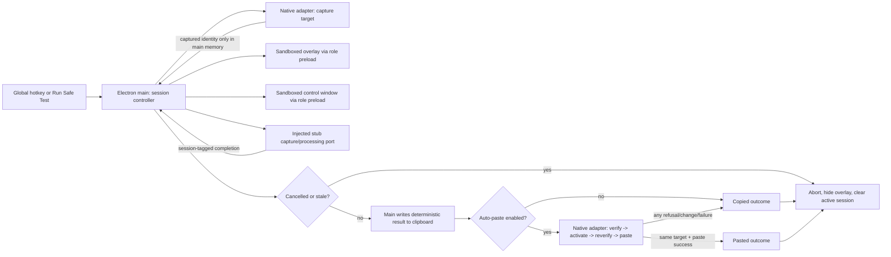

# Phase LT-01: Secure Electron walking skeleton - Research

**Researched:** 2026-07-31
**Domain:** Secure Electron desktop walking skeleton, main-owned lifecycle, and native focus/paste adapters
**Confidence:** MEDIUM

<user_constraints>
## User Constraints (from CONTEXT.md)

### Locked Decisions

### Tracer scope and lifecycle

- **D-01:** Phase 1 is a production-quality tracer, not a throwaway prototype.
  It establishes the real Electron process boundaries and replaceable seams but
  uses stub capture and stub processing only; real PCM and Whisper remain Phase
  2 work.
- **D-02:** One main-owned session follows the documented tap-to-start,
  tap-to-stop state path. A processing hotkey reports busy rather than creating
  another session, stale callbacks are ignored by `sessionId`, and every
  terminal path returns deterministically to idle.
- **D-03:** Escape cancels during stub capture or processing, returns idle
  within two seconds, and produces no clipboard, paste, history, or other text
  persistence outcome.

### Authority and output safety

- **D-04:** Electron main remains the sole application and OS-integration
  authority. Overlay and control renderers are sandboxed behind role-specific
  preloads; renderer messages are authorized by exact window role, validated at
  runtime, bounded, and fail closed.
- **D-05:** Clipboard-only is the default. Main copies the exact successful
  stub result before any optional paste attempt and never restores the previous
  clipboard. A refused, unverifiable, or failed target activation remains
  copy-only and never redirects text to another target.
- **D-06:** Capture the foreground target before showing lazytypr, then validate,
  reactivate, and revalidate the same platform identity immediately before
  paste. Phase 1 proves verified paste only with Windows Notepad and macOS
  TextEdit; the broader target matrix remains Phase 3 work.

### User-visible contract

- **D-07:** Use the authoritative overlay state machine and original lazytypr
  blue/charcoal visual system. The overlay is transparent, always on top,
  non-focusable, shown inactive, exposes redundant icon and text cues, and
  shows copied, pasted, copy-only, busy, cancelled, and error outcomes without
  stealing focus.
- **D-08:** Phase 1 includes only the minimum control surface needed to expose
  hotkey status, clipboard-only versus opt-in auto-paste, and a safe local test
  path. Full onboarding, history, models, diagnostics, localization coverage,
  and accessibility qualification remain Phase 6 work, while Phase 1 must use
  semantic keyboard-operable controls and en-US/pt-BR-ready message keys.

### Cross-cutting gates and delivery

- **D-09:** Normal tracer operation makes no non-loopback connection and starts
  no inference sidecar. Diagnostics and test evidence contain no clipboard
  text, stub result text, focus-target identity, user path, secret, or ordinary
  user content.
- **D-10:** The measurable checkpoint is 20 consecutive development-build
  tracer cycles on each supported OS with no stale focus/session state or
  misdirected paste. Each OS run set includes clipboard-only, verified paste,
  at least one refused or unverifiable target that remains copy-only, and at
  least five cancellations during capture or processing.
- **D-11:** Planning and implementation stay on
  `phase/01-secure-electron-walking-skeleton`, use committed sanitized GSD
  artifacts, and do not auto-advance. No implementation begins until the Phase
  1 plans pass the configured research, UI, security, Nyquist, context-coverage,
  and plan-checker gates and are accepted.
- **D-12:** The Phase 1 tracer uses `Ctrl+Shift+Space` on Windows and
  `Control+Option+Space` on macOS. Registration and retry state are main-owned
  and injected for tests; durable configurable settings remain later scope.
- **D-13:** The native boundary is an attributed MIT-derived C helper on
  Windows and an attributed Swift helper on macOS, built on each target OS and
  using a bounded, sanitized request/result protocol.
- **D-14:** Cancellation uses a main-owned output commit barrier. Before the
  synchronous clipboard write it produces no output; after commit begins the
  clipboard is retained, and cancellation before native paste dispatch
  suppresses paste and completes copy-only.

### the agent's Discretion

The planner may choose exact internal module names, deterministic stub text and
short stub-processing delay, test framework arrangement, and plan boundaries,
provided those choices preserve every authoritative interface, phase boundary,
acceptance outcome, and future replacement seam documented below.

### Deferred Ideas (OUT OF SCOPE)

- Real in-memory PCM and Whisper dictation belong to Phase 2.
- Full hotkey, focus, paste, cancellation, lifecycle, and target-matrix
  hardening belongs to Phase 3.
- Model lifecycle, local translation, history, complete onboarding and control
  panel, diagnostics, packaging, and release qualification remain in Phases
  4-8 exactly as defined by the roadmap.
</user_constraints>

## Project Constraints (from AGENTS.md)

- This research produces only a sanitized `.planning/` artifact; it must not create application source, manifests, helpers, installers, models, or tests before an accepted plan authorizes them. [VERIFIED: AGENTS.md:1-4]
- Accepted ADRs, then `docs/PRODUCT_SPEC.md`, outrank architecture/specification documents and generated planning state; plans must not contradict them. [VERIFIED: AGENTS.md:6-12]
- Preserve in-memory-only audio, main as the sole application/external-download authority, sandboxed renderers, authenticated loopback sidecars, local-only operation, immutable original-provider model policy, confidentiality, and reuse provenance/notice obligations. [VERIFIED: AGENTS.md:14-25]
- A Phase 1 PR uses the phase branch/one-PR workflow, path-scoped Git actions, `reuse lint`, and all applicable `docs/TESTING.md` gates. This research must not commit because its requesting task explicitly forbids committing. [VERIFIED: AGENTS.md:27-32]

<phase_requirements>
## Phase Requirements

The authoritative Phase 1 foundation is: “Phase 1 owns LT-OUT-001 and must also establish the foundational slices of LT-FUN-001, LT-PST-001, LT-CAN-001, LT-NET-001, LT-SEC-001, LT-LIC-001, and LT-PRV-001.” [VERIFIED: docs/PRODUCT_SPEC.md:51-55]

| ID | Description | Research Support |
|----|-------------|------------------|
| LT-OUT-001 | Copy every successful or fallback result before optional paste; paste failure retains the exact clipboard result. [VERIFIED: docs/PRODUCT_SPEC.md:38-39] | Main-only `ClipboardPort` commits the result before calling a focus/paste adapter; adapter failure maps to copy-only. |
| LT-FUN-001 (foundation) | One session at a time; a processing hotkey reports busy. [VERIFIED: docs/PRODUCT_SPEC.md:33] | A single main-owned controller, session token, and stale-update rejection provide the tracer lifecycle seam. |
| LT-PST-001 (foundation) | Paste only into the captured and reverified target. [VERIFIED: docs/PRODUCT_SPEC.md:39] | Platform adapter captures before overlay, verifies/activates/reverifies immediately before paste, and fail-closes. |
| LT-CAN-001 (foundation) | Escape cancels an active phase without copy, paste, or history after transcription. [VERIFIED: docs/PRODUCT_SPEC.md:40] | Abortable stub capture/processing and a pre-output commit barrier return idle within two seconds. |
| LT-NET-001 (foundation) | No non-loopback traffic except an active user-initiated download. [VERIFIED: docs/PRODUCT_SPEC.md:42] | Phase 1 has no download or sidecar path; packaged local assets, restrictive CSP, and blocked navigation/new windows are mandatory. |
| LT-SEC-001 (foundation) | Sandboxed role-specific renderers and authenticated loopback sidecars. [VERIFIED: docs/PRODUCT_SPEC.md:43] | Phase 1 establishes role-specific preload/sender/schema validation; it must prove no sidecar is launched. |
| LT-LIC-001 (foundation) | Preserve license, provenance, notices, and SBOM obligations. [VERIFIED: docs/PRODUCT_SPEC.md:47] | Add SPDX headers/provenance when required, exact lockfile, dependency review, and `reuse lint`; SBOM/package gates remain future scope. |
| LT-PRV-001 (foundation) | Diagnostics contain no audio, text, prompts, secrets, or user paths. [VERIFIED: docs/PRODUCT_SPEC.md:48] | Treat stub text, clipboard, target identity, tokens, and paths as secret-bearing data: never render, log, or put them in test artifacts. |
</phase_requirements>

## Summary

Implement Phase 1 as one production-owned Electron main-process slice with two sandboxed renderers: a non-activating overlay and a conventional control window. Main creates exactly one tracer session, captures the target before the overlay is shown, advances state, writes the deterministic stub result to the clipboard, then asks an OS-specific adapter to verify/activate/reverify/paste. The platform adapter returns only sanitized outcome codes; it never sends a clipboard result, target identity, path, or secret to either renderer. This directly realizes the accepted main-authority and native-focus decisions. [VERIFIED: docs/adr/0002-electron-main-authority.md:6-18] [VERIFIED: docs/adr/0007-native-focus-and-paste.md:6-16]

The plan must divide deterministic local behavior from hardware proof. Unit and Electron integration tests can exhaustively test the state controller with injected clipboard, target, clock, timer, hotkey, and focus/paste fakes. They cannot prove a Windows foreground activation or macOS Accessibility paste. The Phase 1 checkpoint still requires 20 development-build cycles per supported OS, successful paste only in Notepad/TextEdit, one refused/unverifiable copy-only case per OS, and five capture/processing cancellations per OS; label those as future Windows/macOS hardware validation until actually run. [VERIFIED: docs/PRODUCT_SPEC.md:53-63] [VERIFIED: docs/TESTING.md:3-14]

**Primary recommendation:** Build the shared contracts and main-owned tracer state machine first, behind injected OS ports; then add thin Windows/macOS native adapter implementations and verify their only success targets on the matching hardware. Do not let renderer code, generic IPC, or a test fake decide output safety. [CITED: https://www.electronjs.org/docs/latest/tutorial/security]

## Architectural Responsibility Map

| Capability | Primary Tier | Secondary Tier | Rationale |
|------------|--------------|----------------|-----------|
| Session state, cancellation, stale-update rejection | Electron main / API backend | — | Only main may own active session, OS resources, and terminal cleanup. [VERIFIED: docs/ARCHITECTURE.md:129-144] |
| Global hotkey registration/status | Electron main / OS integration | Control renderer | Electron’s `globalShortcut` is a main-process API; the renderer displays normalized status only. [CITED: https://www.electronjs.org/docs/latest/api/global-shortcut/] |
| Foreground target capture, reactivation, revalidation, paste | Native Windows/macOS adapter invoked by main | Electron main | The accepted ADR requires platform-native helpers; UI/renderer must never gain OS focus or clipboard authority. [VERIFIED: docs/adr/0007-native-focus-and-paste.md:6-16] |
| Clipboard write and copy-first ordering | Electron main / OS integration | Native adapter reads system clipboard only to paste | Main owns clipboard/paste; copy must finish before any optional adapter paste call. [VERIFIED: docs/adr/0002-electron-main-authority.md:8-13] |
| Overlay presentation | Sandboxed overlay renderer | Electron main | Renderer renders a redacted state snapshot; main shows it inactive and controls visibility. [VERIFIED: .planning/phases/LT-01-secure-electron-walking-skeleton/01-UI-SPEC.md:14-20] |
| Control test/safety UI | Sandboxed control renderer | Electron main | Semantic controls request named actions through a role-specific preload; no direct privilege. [VERIFIED: docs/IPC_CONTRACTS.md:117-129] |
| IPC authorization/schema limits | Electron main | Role-specific preload | The contract requires exact sender/window-role authorization, runtime validation, rejected unknown keys, and bounded strings. [VERIFIED: docs/IPC_CONTRACTS.md:1-6] |
| Network and permission policy | Electron main | — | Main configures session-wide denial-by-default; renderers cannot navigate/open windows/download. [VERIFIED: docs/SECURITY_AND_PRIVACY_DESIGN.md:33-48] |

## Standard Stack

### Core

| Library | Version | Purpose | Why Standard |
|---------|---------|---------|--------------|
| `electron` [WARNING: flagged as suspicious — verify before using.] | `41.2.0` | Main process, windows, global hotkey, clipboard, and sandboxed renderer runtime. | Project-pinned and official Electron APIs cover the required two-window/main-process architecture. [VERIFIED: docs/DEVELOPMENT.md:5-10] [CITED: https://www.electronjs.org/docs/latest/api/browser-window] |
| `react` [WARNING: flagged as suspicious — verify before using.] and `react-dom` [WARNING: flagged as suspicious — verify before using.] | `19.1.0` | Declarative control and overlay rendering only. | React is project-pinned; `react-dom` is a necessary renderer counterpart but is not explicitly named by the project and therefore remains an assumption pending plan checkpoint. [VERIFIED: docs/DEVELOPMENT.md:5-10] [ASSUMED] |
| `typescript` [WARNING: flagged as suspicious — verify before using.] | `6.0.2` | Strict shared contracts and process-boundary types. | Project-pinned; Zod complements rather than replaces TypeScript at runtime. [VERIFIED: docs/DEVELOPMENT.md:5-10] [CITED: https://zod.dev/] |
| `vite` [WARNING: flagged as suspicious — verify before using.] | `8.1.4` | Renderer development/build pipeline. | Project-pinned; Vite documents the React TypeScript template family. [VERIFIED: docs/DEVELOPMENT.md:5-10] [CITED: https://vite.dev/guide/] |
| `zod` | `4.3.6` | Runtime validation of IPC requests and snapshots. | Project-pinned; Zod supports TypeScript-first validation and strict object schemas needed to reject unknown IPC keys. [VERIFIED: docs/DEVELOPMENT.md:7-10] [CITED: https://zod.dev/api?id=sets] |

### Supporting

| Library | Version | Purpose | When to Use |
|---------|---------|---------|-------------|
| `vitest` [WARNING: flagged as suspicious — verify before using.] | `4.1.10` (registry current at research) | Node-environment domain/main unit and property tests. | Use for state-machine, race, IPC schema, and fake-port tests; it shares Vite configuration. [CITED: https://vitest.dev/guide/index.html] |
| `@playwright/test` [WARNING: flagged as suspicious — verify before using.] | `1.62.1` (registry current at research) | Electron integration/UI boundary tests. | Use only for application windows and injected fakes; Playwright describes Electron automation support as experimental, so it is not hardware focus/paste evidence. [CITED: https://playwright.dev/docs/api/class-electron] |

### Deliberately Deferred

Do **not** add Phase 1 dependencies merely because they appear in the project’s future baseline: `tailwindcss`, `electron-builder`, `better-sqlite3`, and `react-i18next` support later concerns and are not required to prove this tracer. The pinned baseline lists them, but neither a database/history/model flow nor packaging/localization qualification belongs in this phase. [VERIFIED: docs/DEVELOPMENT.md:5-10] [VERIFIED: .planning/phases/LT-01-secure-electron-walking-skeleton/01-CONTEXT.md:176-184]

### Alternatives Considered

| Instead of | Could Use | Tradeoff |
|------------|-----------|----------|
| Main-owned Electron + native adapters | Renderer-side clipboard/focus packages | Rejected: contradicts the sole-main-authority ADR and gives an XSS-compromised renderer OS authority. [VERIFIED: docs/adr/0002-electron-main-authority.md:8-18] |
| Thin, platform-specific native adapters | One cross-platform simulated paste implementation | Rejected: accepted ADR requires separate Windows/macOS helpers and hardware tests; platform focus policy is intentionally not abstracted away. [VERIFIED: docs/adr/0007-native-focus-and-paste.md:13-16] |
| Vitest + injected ports | Unit tests that instantiate Electron/real OS globally | Rejected: real global shortcuts and clipboard state make unit tests nondeterministic and unsafe to run in parallel. [ASSUMED] |
| Playwright Electron integration | Playwright as native focus/paste proof | Rejected: its Electron automation support is experimental and its main-process evaluation cannot establish OS-level target safety. [CITED: https://playwright.dev/docs/api/class-electron] |

**Installation (after the required human package-verification checkpoint):**

```bash
npm install electron@41.2.0 react@19.1.0 react-dom@19.1.0 zod@4.3.6
npm install -D typescript@6.0.2 vite@8.1.4 vitest@4.1.10 @playwright/test@1.62.1
```

The plan must make the version selection/review and lockfile creation an explicit task, then use `npm ci` for subsequent clean installs. The project requires exact release versions and `npm ci`. [VERIFIED: docs/DEVELOPMENT.md:7-10]

## Package Legitimacy Audit

Registry commands were executed on 2026-07-31. The published dates below are for the exact version when one is pinned; the legitimacy seam evaluates current package metadata. Each listed package had no reported `postinstall` script. Package names from `docs/DEVELOPMENT.md` are project-authoritative; `react-dom`, Vitest, and Playwright come from ordinary implementation knowledge/official documentation as noted above. [VERIFIED: docs/DEVELOPMENT.md:5-10] [CITED: https://vitest.dev/guide/index.html] [CITED: https://playwright.dev/docs/intro]

| Package | Registry | Exact version / published | Source Repo | Verdict | Disposition |
|---------|----------|---------------------------|-------------|---------|-------------|
| `electron` | npm | `41.2.0`, 2026-04-08 | github.com/electron/electron | SUS (`too-new` current metadata) | Flagged — human verify before install |
| `react` | npm | `19.1.0`, 2025-03-28 | github.com/react/react | SUS (`too-new` current metadata) | Flagged — human verify before install |
| `react-dom` | npm | `19.1.0`, 2025-03-28 | github.com/react/react | SUS (`too-new` current metadata) | Flagged — human verify before install |
| `typescript` | npm | `6.0.2`, 2026-03-23 | github.com/microsoft/TypeScript | SUS (`too-new` current metadata) | Flagged — human verify before install |
| `vite` | npm | `8.1.4`, 2026-07-09 | github.com/vitejs/vite | SUS (`too-new` current metadata) | Flagged — human verify before install |
| `zod` | npm | `4.3.6`, 2026-01-22 | github.com/colinhacks/zod | OK | Approved |
| `vitest` | npm | `4.1.10`, 2026-07-06 | github.com/vitest-dev/vitest | SUS (`too-new`) | Flagged — human verify before install |
| `@playwright/test` | npm | `1.62.1`, 2026-07-30 | github.com/microsoft/playwright | SUS (`too-new`) | Flagged — human verify before install |

**Packages removed due to [SLOP] verdict:** none.

**Packages flagged as suspicious [SUS]:** `electron`, `react`, `react-dom`, `typescript`, `vite`, `vitest`, and `@playwright/test`. The planner must insert `checkpoint:human-verify` before the first install because the legitimacy seam flagged them. Registry existence is not sufficient package provenance. [VERIFIED: npm registry + package-legitimacy seam]

## Architecture Patterns

### System Architecture Diagram



This diagram intentionally keeps the native target descriptor and final result out of renderer payloads. The project’s authoritative `FocusTarget` contract is quoted verbatim: `platform: "win32" | "darwin";`, `pid: number;`, `windowHandle?: string;`, `bundleId?: string;`, `capturedAt: string;`, and `sessionId: string;`. [VERIFIED: docs/IPC_CONTRACTS.md:43-50] The descriptor is main-memory-only and must never be persisted. [VERIFIED: docs/adr/0007-native-focus-and-paste.md:8-11]

### Recommended Project Structure

```text
src/
├── main/                 # bootstrap, secure session policy, window creation, IPC registration
│   ├── tracer/           # controller, deterministic stub port, lifecycle cleanup
│   ├── os/               # ClipboardPort, HotkeyPort, FocusPasteAdapter interfaces/implementations
│   └── security/         # sender-role guard, schemas, navigation/permission policy
├── preload/
│   ├── control.ts        # named control-only bridge methods
│   └── overlay.ts        # named overlay-only bridge methods
├── renderer/
│   ├── control/          # minimum semantic tracer controls and modal
│   └── overlay/          # redacted status pill only
├── shared/               # validated public snapshots/message keys; no OS descriptors or result text
└── native/               # target-built Windows/macOS helper sources plus documented wire contract
tests/
├── unit/                 # controller, schema, fake-port, and race/property tests
├── integration/          # Electron/Playwright tests with injected fake ports
└── hardware/             # manual run-sheet/evidence templates, not CI substitutes
```

The names are a recommendation under the explicit naming discretion; the boundary is not discretionary. The shared IPC contract must retain the already-authoritative roles—`type WindowRole = "overlay" | "control";`—and must not leak raw Electron objects. [VERIFIED: docs/IPC_CONTRACTS.md:8-17] [VERIFIED: docs/IPC_CONTRACTS.md:127-129]

### Pattern 1: Capability ports with a deterministic tracer controller

**What:** Create interfaces for clock/timer, hotkey, clipboard, target adapter, and stub work. The controller alone owns `activeSession`; production implementations perform Electron/OS effects and test implementations return deterministic outcomes. [ASSUMED]

**When to use:** Always—this is the seam that permits high-coverage state tests without registering a global shortcut, modifying the developer’s clipboard, or invoking a native helper. [ASSUMED]

**Design sketch (not an accepted public interface):**

```ts
// [ASSUMED] Internal Phase 1 seam; do not expose through preload.
interface FocusPasteAdapter {
  captureForeground(signal: AbortSignal): Promise<CapturedTarget | undefined>;
  verifyActivateReverifyAndPaste(
    target: CapturedTarget,
    signal: AbortSignal,
  ): Promise<PasteAttempt>;
}

interface ClipboardPort {
  writeAfterAbortCheck(value: string, signal: AbortSignal): Promise<void>;
}
```

The implementation sequence is non-negotiable: capture target → show inactive overlay → stub work → reject stale/cancelled completion → clipboard write → optional verify/activate/reverify/paste → one terminal outcome → cleanup. It mirrors the authoritative dictation sequence while replacing only capture/transcription with stubs. [VERIFIED: docs/ARCHITECTURE.md:80-102]

### Pattern 2: Output commit barrier and terminal cleanup

**What:** Treat the first clipboard write as an irreversible output commit. A cancellation observed before this barrier produces the locked no-output cancellation result; once the write begins, never restore or clear the previous clipboard and never proceed to paste after an abort. Every terminal path clears the active session, cancels timers, hides the overlay after its bounded outcome, and ignores future callbacks carrying the old session token. [VERIFIED: .planning/phases/LT-01-secure-electron-walking-skeleton/01-CONTEXT.md:28-34] [VERIFIED: docs/adr/0007-native-focus-and-paste.md:8-11]

**When to use:** For success, stub failure, busy display restoration, cancellation, window destruction, hotkey registration failure, and application shutdown. The full architecture requires terminal cleanup on success, failure, cancellation, renderer/sidecar crash, exit, and startup recovery; Phase 1 must establish the same ownership shape even though it starts no sidecar. [VERIFIED: docs/ARCHITECTURE.md:141-144]

### Pattern 3: Narrow, role-checked IPC

**What:** Register fixed named handlers; for each call, verify `event.sender` is the expected registered `webContents`, verify the expected role, parse a strict bounded schema, and return a sanitized result. Preloads export one function per allowed command/subscription and a disposer—never an arbitrary channel function or raw `ipcRenderer`. [CITED: https://www.electronjs.org/docs/latest/tutorial/ipc] [CITED: https://www.electronjs.org/docs/latest/tutorial/security]

**When to use:** Both control actions (safe test, auto-paste preference, cancel) and overlay actions (dismiss/cancel only), as well as every state event. The existing contract is explicit that `session:cancel` is authorized only from the exact registered overlay/control sender for the current main-owned session. [VERIFIED: docs/IPC_CONTRACTS.md:102-115]

### Pattern 4: Native adapters report capability/outcome, not data

**What:** Each helper accepts only an opaque captured target held by main and a requested operation. It returns a bounded enum/reason code such as verified-pasted, target-not-verified, permission-denied, or activation-denied; helper stdout/stderr and main logs must not include target title, bundle name, user path, clipboard value, or stub text. Exact wire names are deliberately deferred to the plan. [ASSUMED]

**When to use:** Windows adapter uses native foreground/window identity APIs; macOS adapter uses Accessibility APIs. Windows can deny `SetForegroundWindow` under foreground-stealing restrictions, so a false result is a normal safe fallback—not a retry/force-focus opportunity. [CITED: https://learn.microsoft.com/en-us/windows/win32/api/winuser/nf-winuser-setforegroundwindow]

### Anti-Patterns to Avoid

- **Renderer-owned OS access:** No renderer reads/writes clipboard, registers hotkeys, observes foreground windows, invokes shell/native helper, or owns a session. This violates the main-authority ADR. [VERIFIED: docs/adr/0002-electron-main-authority.md:8-18]
- **Generic IPC proxy:** Do not expose `send`, `invoke`, channel strings, Electron objects, event senders, or arbitrary subscriptions through context bridge. [VERIFIED: docs/IPC_CONTRACTS.md:127-129] [CITED: https://www.electronjs.org/docs/latest/tutorial/ipc]
- **Target identity by title/process name alone:** Capture exact platform identity and revalidate it after activation; titles are mutable and PID-only identity can be reused. [ASSUMED]
- **Attempting paste before a confirmed clipboard write:** It violates LT-OUT-001 and makes a paste failure lose the only dependable output. [VERIFIED: docs/PRODUCT_SPEC.md:38-39]
- **Making hidden overlay focusable to catch Escape:** Register Escape/cancellation in main and provide the conventional control window alternate action. [VERIFIED: docs/UI_SPEC.md:42-44]
- **Treating the Vite dev server or Playwright as packaged/hardware evidence:** Development traffic and renderer automation are not proof of local packaged operation or native target safety. [VERIFIED: docs/TESTING.md:3-14] [CITED: https://playwright.dev/docs/api/class-electron]

## Don't Hand-Roll

| Problem | Don't Build | Use Instead | Why |
|---------|-------------|-------------|-----|
| Renderer sandboxing/context bridging | A homegrown postMessage privilege layer | Electron `contextIsolation`, `sandbox`, preload `contextBridge`, and main validation | Electron documents these as core security controls; a custom bridge easily exposes arbitrary IPC. [CITED: https://www.electronjs.org/docs/latest/tutorial/security] |
| IPC object validation | TypeScript casts or hand-written ad hoc checks per channel | Zod strict schemas at the main boundary | TypeScript disappears at runtime; Zod supports strict object rejection needed by the documented unknown-key policy. [VERIFIED: docs/IPC_CONTRACTS.md:1-6] [CITED: https://zod.dev/api?id=sets] |
| Renderer E2E window automation | A custom DOM driver | Playwright Electron support behind injected fakes | It launches Electron and exposes window/main evaluation, but remains experimental and cannot replace hardware proof. [CITED: https://playwright.dev/docs/api/class-electron] |
| Cross-platform focus/paste | Keyboard simulation from Electron/renderer or one generic package | Small target-built Windows and macOS helpers behind one main-owned port | The accepted ADR requires native capture/validate/reactivate/revalidate/paste and separate hardware tests. [VERIFIED: docs/adr/0007-native-focus-and-paste.md:6-16] |
| Session cleanup/race management | Scattered timer callbacks and mutable global booleans | One controller with session token + AbortController + centralized `finally` cleanup | The architecture explicitly requires stale callbacks to be discarded and resources released on terminal paths. [VERIFIED: docs/ARCHITECTURE.md:129-144] |

**Key insight:** Phase 1 should hand-roll only its domain policy—the copy-first state machine and fail-closed adapter contract. The security/runtime primitives belong to Electron, Zod, native OS APIs, and the test framework. [CITED: https://www.electronjs.org/docs/latest/tutorial/security]

## Common Pitfalls

### Pitfall 1: Overlay steals focus or target is captured too late

**What goes wrong:** The overlay becomes the foreground window and the adapter captures lazytypr instead of the user’s intended application.
**Why it happens:** Showing/focusing UI before target capture or using `show()` rather than `showInactive()`. Electron documents that `showInactive()` displays a window without focusing it; `focusable: false` and `alwaysOnTop` have platform-specific behavior. [CITED: https://www.electronjs.org/docs/latest/api/base-window]
**How to avoid:** Capture first; create overlay with transparency, `focusable: false`, `alwaysOnTop`, and show it only with `showInactive()`. Place it in the active target display work area using Electron DIP coordinates; recompute on display/work-area/scale events. [VERIFIED: .planning/phases/LT-01-secure-electron-walking-skeleton/01-UI-SPEC.md:91-97] [CITED: https://www.electronjs.org/docs/latest/api/screen]
**Warning signs:** The captured adapter target belongs to lazytypr, the overlay becomes tab-focusable, or multi-display/scaled screenshots clip/spill the pill.

### Pitfall 2: State timers resurrect a completed/cancelled session

**What goes wrong:** A delayed stub completion or terminal-hide timer updates a new session, re-shows the overlay, or pastes after cancellation.
**Why it happens:** Callbacks lack session identity, cleanup is split across code paths, or a test fake resolves after abort.
**How to avoid:** Associate every async completion/timer with the current session token; compare it before every transition and destroy it centrally at terminal cleanup. The authoritative lifecycle already says callbacks carry `sessionId` and stale callbacks are discarded. [VERIFIED: docs/ARCHITECTURE.md:129-144]
**Warning signs:** A rapid start/cancel/start test reports two terminal outcomes, active-session count exceeds one, or a fake completion mutates an idle controller.

### Pitfall 3: Cancellation claims a stronger guarantee than the clipboard API can provide

**What goes wrong:** The UI says cancelled while the clipboard has already changed, or cancellation races into optional paste.
**Why it happens:** Clipboard writes are an output commit and cannot safely be “restored” under the product policy.
**How to avoid:** Make stub capture/processing abortable; check the abort signal immediately before clipboard commit; after commit, do not restore clipboard and suppress optional paste if an abort is observed. The Phase 1 measurable cancellation requirement is specifically capture/processing cancellation with no output. [VERIFIED: docs/PRODUCT_SPEC.md:55-61]
**Warning signs:** Tests attempt to restore prior clipboard contents, cancellation after a started write is labelled “nothing was copied,” or cancellation can continue into paste.

### Pitfall 4: Native activation failure becomes a focus-stealing workaround

**What goes wrong:** The app retries against the current foreground window, simulates keys blindly, or escalates privileges after target activation fails.
**Why it happens:** Windows can deny foreground activation even for a desktop app, and target privilege/accessibility state varies. [CITED: https://learn.microsoft.com/en-us/windows/win32/api/winuser/nf-winuser-setforegroundwindow]
**How to avoid:** Any capture/verify/activate/reverify/paste mismatch or refusal maps exactly to copy-only. Do not broaden the target, restore old clipboard, or retry automatically. [VERIFIED: docs/PRODUCT_SPEC.md:73-79]
**Warning signs:** A helper falls back to “current foreground”, an elevated/refused test receives text, or logs include identity data.

### Pitfall 5: Secure BrowserWindow defaults are assumed rather than enforced/tested

**What goes wrong:** Development shortcuts add Node integration, broad permissions, navigation, new windows, remote assets, or raw IPC exposure.
**Why it happens:** Electron defaults change and a preload remains privileged even with a sandboxed renderer. [CITED: https://www.electronjs.org/docs/latest/tutorial/sandbox]
**How to avoid:** Explicitly configure `nodeIntegration: false`, `contextIsolation: true`, `sandbox: true`, and `webSecurity: true`; deny navigation/new windows/webviews/downloads; configure permission checks and requests to deny everything except only the eventual explicitly authorized path. Keep Phase 1 microphone permission denied because real capture is Phase 2. [VERIFIED: docs/ARCHITECTURE.md:57-60] [VERIFIED: docs/SECURITY_AND_PRIVACY_DESIGN.md:33-40] [CITED: https://www.electronjs.org/docs/latest/api/session]
**Warning signs:** A security test can send from an unknown `webContents`, a renderer sees `ipcRenderer`, an external URL loads, or a CSP/network scan finds a non-loopback endpoint.

### Pitfall 6: Accidentally pulls later-phase behavior into the tracer

**What goes wrong:** The plan adds recording, sidecar launch, database/history, models/downloads, notifications, configuration/tray, or generic onboarding “placeholders.”
**Why it happens:** Walking skeleton is mistaken for a product shell.
**How to avoid:** The only user surfaces are the locked overlay and minimum control window; normal Phase 1 tracer operation starts no sidecar and has no non-loopback application traffic. [VERIFIED: .planning/phases/LT-01-secure-electron-walking-skeleton/01-UI-SPEC.md:14-20] [VERIFIED: .planning/phases/LT-01-secure-electron-walking-skeleton/01-CONTEXT.md:64-69]
**Warning signs:** Package/source diff contains model/runtime/history modules or a test needs real microphone/model data.

## Code Examples

### Secure window policy

Use one shared main-only window factory that hardens both renderers, then applies overlay/control layout differences. This is a pattern derived from Electron’s security checklist and BrowserWindow documentation; exact project filenames and objects are intentionally left to the plan. [CITED: https://www.electronjs.org/docs/latest/tutorial/security] [CITED: https://www.electronjs.org/docs/latest/api/browser-window]

```ts
// [ASSUMED] Skeleton only: no renderer receives Electron or OS capabilities.
const secureWebPreferences = {
  nodeIntegration: false,
  contextIsolation: true,
  sandbox: true,
  webSecurity: true,
  webviewTag: false,
};
```

The shared contract values which remain authoritative are quoted verbatim: `type WindowRole = "overlay" | "control";` and `session:state-changed` is sent to `overlay, control` as a `SessionSnapshot` “with text omitted from overlay when unnecessary.” [VERIFIED: docs/IPC_CONTRACTS.md:10-17] [VERIFIED: docs/IPC_CONTRACTS.md:117-126]

### Main-side sender/schema guard sequence

1. Map registered `webContents.id` to a fixed window role at creation; do not accept a role supplied by the renderer. [ASSUMED]
2. On a named handler, reject a sender that does not exactly match the registered web contents and expected main-frame role. [VERIFIED: docs/IPC_CONTRACTS.md:111-115]
3. Parse a strict Zod schema with a bounded string/identifier policy; unknown keys, empty/stale session IDs, and excessive payloads produce a sanitized rejection. [VERIFIED: docs/IPC_CONTRACTS.md:1-6] [CITED: https://zod.dev/api?id=sets]
4. Dispatch only a main-owned operation and return a data-minimized result. Expected errors use the project `Result` boundary rather than thrown implementation details: `type Result<T, E = AppError> = | { ok: true; value: T } | { ok: false; error: E };`. [VERIFIED: docs/IPC_CONTRACTS.md:19-28]

### Deterministic tracer test fake

Use a test-only fake that has controllable deferred completion, target outcome, hotkey status, and clipboard observation. It must capture the deterministic stub value only in a test assertion; no screenshot, accessibility tree, reporter attachment, main log, or failure message includes it. This satisfies the source rule that Phase 1 diagnostics/evidence omit clipboard/stub/target/path/secret content. [VERIFIED: .planning/phases/LT-01-secure-electron-walking-skeleton/01-CONTEXT.md:64-69]

## State of the Art

| Old Approach | Current Approach | When Changed | Impact |
|--------------|------------------|--------------|--------|
| Disable isolation or provide Node globals to make renderer development easy | Context isolation is Electron’s default from Electron 12; sandboxing is default from Electron 20 | Electron documentation | Explicitly keep both enabled; narrow preloads are still necessary. [CITED: https://www.electronjs.org/docs/latest/tutorial/context-isolation] [CITED: https://www.electronjs.org/docs/latest/tutorial/sandbox] |
| Treat failed shortcut registration as an exception | `globalShortcut.register()` returns a boolean and OS conflicts silently fail | Current Electron API | Report normalized unavailable status, preserve prior registration, offer retry/recovery. [CITED: https://www.electronjs.org/docs/latest/api/global-shortcut/] |
| Use a newer global-shortcut suspension API during rebinding | `globalShortcut.setSuspended()` is documented as Electron 42+ | Electron API | Do not use it: Phase 1 pins Electron 41.2.0; register/unregister behavior must be sufficient. [VERIFIED: docs/DEVELOPMENT.md:5-10] [CITED: https://www.electronjs.org/docs/latest/api/global-shortcut/] |

**Deprecated/outdated:** Do not enable deprecated renderer paste (`document.execCommand("paste")`) or any renderer clipboard-read route. Phase 1 has no renderer clipboard authority and main copies only the deterministic successful outcome. [VERIFIED: docs/adr/0002-electron-main-authority.md:8-13] [CITED: https://www.electronjs.org/docs/latest/api/browser-window]

## Assumptions Log

| # | Claim | Section | Risk if Wrong |
|---|-------|---------|---------------|
| A1 | `react-dom` must be installed alongside project-pinned React for React renderer mounting. | Standard Stack | Package set would need adjustment before the first install. |
| A2 | Native helper returns only bounded outcome codes and accepts an opaque main-owned target descriptor. | Architecture Patterns | The plan might need a different audited IPC/wire contract, but must retain data minimization and fail-closed semantics. |
| A3 | A port-injected controller and deterministic fakes are sufficient for high-coverage local lifecycle tests. | Architecture Patterns | Test design could require an additional Electron abstraction seam. |
| A4 | Target title/process name alone is insufficient for safe target identity. | Anti-Patterns | Adapter identity record may need stronger OS-specific fields/revalidation rules. |

## Resolved Research Questions

1. **Native-helper build/toolchain choice and exact wire protocol**
   - What we know: the ADR requires small separate Windows/macOS helpers, built on their target OS, and Phase 1 has only Notepad/TextEdit successful-paste obligations. [VERIFIED: docs/adr/0007-native-focus-and-paste.md:8-16] [VERIFIED: docs/DEVELOPMENT.md:32-37]
   - Resolution: `PLAN.md` section 11 fixes an attributed MIT-derived C helper on Windows and a Swift helper on macOS, each built on its target OS. The plan must specify a bounded, sanitized request/result protocol, native-target build instructions, source/license provenance, and a `checkpoint:human-verify` before adding an unpinned build dependency. Do not use a generic third-party focus/paste package without the same review.

2. **Exact hotkey accelerator and persistence behavior**
   - What we know: hotkey must be global/main-owned, conflict returns unavailable/recovery, and tap-to-start/tap-to-stop is locked. Electron can silently return `false` when another application owns the accelerator. [VERIFIED: .planning/phases/LT-01-secure-electron-walking-skeleton/01-CONTEXT.md:28-31] [CITED: https://www.electronjs.org/docs/latest/api/global-shortcut/]
   - Resolution: `PLAN.md` section 3 fixes `Ctrl+Shift+Space` on Windows and `Control+Option+Space` on macOS. Model registration as an injected main-owned port and defer durable configurable settings—not registration/retry state—to its owning phase.

3. **Copying-state cancellation boundary**
   - What we know: the UI permits cancellation while copying is still cancellable, while the measurable no-output cancellation gate explicitly covers stub capture/processing; clipboard restoration is forbidden. [VERIFIED: .planning/phases/LT-01-secure-electron-walking-skeleton/01-UI-SPEC.md:121-128] [VERIFIED: docs/PRODUCT_SPEC.md:55-61] [VERIFIED: docs/adr/0007-native-focus-and-paste.md:8-11]
   - Resolution: the authoritative product/UI contracts now define a pre-write abort/commit barrier. Before it, cancellation produces no output. After it, the clipboard is retained; cancellation may suppress a not-yet-dispatched paste and must report copy-only rather than claim that nothing was copied.

## Environment Availability

| Dependency | Required By | Available | Version | Fallback |
|------------|-------------|-----------|---------|----------|
| Node.js | installation/build/test tooling | ✓ | `v26.1.0` on this Linux research host | Project pins Node 24 LTS for implementation; use target environment/CI for final evidence. [VERIFIED: local command `node --version`] |
| npm | lockfile/install/test scripts | ✓ | `11.14.1` | Use project-pinned npm lockfile workflow. [VERIFIED: local command `npm --version`] |
| Electron CLI/runtime | local Electron integration | ✗ | no application install exists | Wave 0 installs locked package after human package verification. [VERIFIED: local command `command -v electron`] |
| Windows 11 x64 host + Notepad | Windows focus/paste hardware gate | ✗ | Linux research host | Future Windows hardware validation; cannot be simulated as equivalent. [VERIFIED: docs/PRODUCT_SPEC.md:55-60] |
| macOS 13+ arm64 host + TextEdit + Accessibility grant | macOS focus/paste hardware gate | ✗ | Linux research host | Future macOS hardware validation; cannot be simulated as equivalent. [VERIFIED: docs/PRODUCT_SPEC.md:55-60] |
| REUSE CLI | current/future license gate | ✗ | command absent | Install/use approved project tooling before phase PR; `reuse lint` remains mandatory. [VERIFIED: local command `reuse --version`] [VERIFIED: docs/LICENSING.md:49-55] |

**Linux-host boundary:** The available Linux host may perform source inspection, type/lint/unit tests, deterministic Electron tests where the Electron runtime is installed, documentation validation, and package/supply-chain checks. It cannot validate Windows foreground policy/Notepad or macOS Accessibility/TextEdit; those remain future hardware evidence. [VERIFIED: docs/TESTING.md:3-14] [VERIFIED: docs/TESTING.md:50-59]

**Missing dependencies with no fallback:** Windows 11 and macOS hardware for the Phase 1 20-cycle native target proof.

**Missing dependencies with fallback:** Local Electron and REUSE CLIs—install only as an accepted-plan step after the described package/provenance review.

## Validation Architecture

### Test Framework

| Property | Value |
|----------|-------|
| Framework | Proposed `vitest@4.1.10` for Node/main-domain tests and proposed `@playwright/test@1.62.1` for Electron integration; both need the package legitimacy human checkpoint. [CITED: https://vitest.dev/guide/index.html] [CITED: https://playwright.dev/docs/api/class-electron] |
| Config file | None exists — Wave 0 creates TypeScript/Vite/Vitest and Playwright configuration after the plan is accepted. [VERIFIED: repository file discovery, 2026-07-31] |
| Quick run command | Future: `npm run test:unit` (must execute `vitest run`). [CITED: https://vitest.dev/guide/index.html] |
| Full suite command | Future: `npm run check` chaining format check, lint, strict typecheck, unit, Electron integration, security/package scans, and `reuse lint`. [VERIFIED: docs/TESTING.md:29-37] [VERIFIED: docs/LICENSING.md:49-55] |

### Phase Requirements → Test Map

| Req ID | Behavior | Test Type | Automated Command | File Exists? |
|--------|----------|-----------|-------------------|-------------|
| LT-OUT-001 | Clipboard completes before paste attempt; refused/failed paste retains exact clipboard fake value. | unit + Electron integration | `npm run test:unit -- tracer-output` and `npm run test:electron -- output` | ❌ Wave 0 |
| LT-FUN-001 foundation | One active session, tap stop, processing busy, stale callbacks ignored, all terminal paths idle. | unit/property | `npm run test:unit -- tracer-state` | ❌ Wave 0 |
| LT-PST-001 foundation | Capture before overlay; paste port must reverify same target; all mismatch/refusal codes become copy-only. | unit + fake-adapter integration | `npm run test:unit -- focus-paste` | ❌ Wave 0 |
| LT-CAN-001 foundation | Capture/processing cancel reaches idle in ≤2 s and performs no fake clipboard/paste/history output. | unit with deterministic clock + integration | `npm run test:unit -- tracer-cancel` | ❌ Wave 0 |
| LT-NET-001 foundation | Packaged renderer policy/CSP/navigation handlers contain no non-loopback route or sidecar launch path. | static/security + Electron integration | `npm run test:security -- network` | ❌ Wave 0 |
| LT-SEC-001 foundation | Unknown/stale sender, wrong role, unknown key, oversize payload, raw-IPC exposure, and sidecar-start attempt are rejected. | unit + Electron integration | `npm run test:security -- ipc` | ❌ Wave 0 |
| LT-LIC-001 foundation | New files have correct REUSE treatment; lockfile/dependency review is reproducible. | static/license | `reuse lint` | partially — `REUSE.toml` exists, application files do not |
| LT-PRV-001 foundation | Renderer state, logs, diagnostics, screenshot/report fixtures omit stub text, clipboard, target identity, path, secret, session ID. | unit/static + integration | `npm run test:security -- redaction` | ❌ Wave 0 |

### Sampling Rate

- **Per task commit:** future `npm run test:unit` plus touched-file format/type checks; documentation-only changes currently use the gates in `docs/TESTING.md`. [VERIFIED: docs/TESTING.md:16-27]
- **Per wave merge:** future `npm run check`.
- **Phase gate:** full local suite green **and** the separately recorded Windows/macOS 20-cycle development-build run sheet. Do not label Playwright or Linux results as hardware validation. [VERIFIED: docs/PRODUCT_SPEC.md:53-63]

### Wave 0 Gaps

- [ ] `package.json` and exact npm lockfile — install only reviewed/pinned direct Phase 1 packages.
- [ ] Strict `tsconfig` plus shared Vite/Vitest config; Zod documents strict TypeScript as a requirement. [CITED: https://zod.dev/]
- [ ] Test fixtures/ports: deterministic clock, hotkey, clipboard, target adapter, and stub processor fakes.
- [ ] `tests/unit/tracer-state.test.ts` — controller, output ordering, cancellation, stale callbacks, and terminal cleanup.
- [ ] `tests/unit/ipc-security.test.ts` — role/sender/schema/size rejection and public snapshot redaction.
- [ ] `tests/integration/tracer.electron.spec.ts` — main/renderer two-window path with injected fakes, including overlay non-focus/hidden terminal state.
- [ ] `tests/hardware/phase1-run-sheet.md` — Windows Notepad/macOS TextEdit 20-cycle evidence form that records outcomes only, never result/target data.
- [ ] Security/static scripts for CSP, navigation/new-window denial, endpoint scan, no sidecar launch, prohibited sensitive strings in reports, dependency license review, and `reuse lint`.

## Security Domain

### Applicable ASVS Categories

| ASVS Category | Applies | Standard Control |
|---------------|---------|------------------|
| V2 Authentication | No user/account authentication | No accounts exist; sidecar authentication is deferred and Phase 1 proves no sidecar launch. [VERIFIED: docs/adr/0009-local-only-product.md:6-15] |
| V3 Session Management | Yes | One main-owned session token, abort signal, stale callback rejection, and terminal cleanup. [VERIFIED: docs/ARCHITECTURE.md:129-144] |
| V4 Access Control | Yes | Exact sender webContents + fixed window-role authorization; role-specific preloads. [VERIFIED: docs/IPC_CONTRACTS.md:1-6] |
| V5 Input Validation | Yes | Strict runtime schema, unknown-key rejection, bounded strings/identifiers; Zod in main. [VERIFIED: docs/IPC_CONTRACTS.md:1-6] [CITED: https://zod.dev/api?id=sets] |
| V6 Cryptography | No Phase 1 secret-bearing protocol | Do not invent cryptography; future sidecars use main-only per-launch secret on random loopback ports. [VERIFIED: docs/adr/0004-authenticated-loopback-sidecars.md:6-15] |
| V7 Error Handling and Logging | Yes | Sanitized public error keys/reasons only; do not log clipboard, stub text, target identity, paths, secrets, or session IDs. [VERIFIED: .planning/phases/LT-01-secure-electron-walking-skeleton/01-CONTEXT.md:64-69] |
| V14 Configuration | Yes | Explicit hardened BrowserWindow/session policy, packaged local content, restrictive CSP, no generic navigation/new windows/downloads. [VERIFIED: docs/SECURITY_AND_PRIVACY_DESIGN.md:33-40] [CITED: https://www.electronjs.org/docs/latest/tutorial/security] |

### Known Threat Patterns for Phase 1

| Pattern | STRIDE | Standard Mitigation |
|---------|--------|---------------------|
| Malicious/compromised renderer invokes a privileged action | Elevation of Privilege | Sandbox/isolation/no Node, narrow preload, exact sender-role/schema/size checks in main. [VERIFIED: docs/SECURITY_AND_PRIVACY_DESIGN.md:15-23] |
| Stale/crafted IPC or delayed stub completion changes new session | Tampering | Current-session token comparison before every transition; central abort/cleanup. [VERIFIED: docs/ARCHITECTURE.md:129-144] |
| Paste directed to a changed/elevated/inaccessible target | Tampering | Capture before overlay; validate/activate/revalidate same target; any failure is copy-only. [VERIFIED: docs/SECURITY_AND_PRIVACY_DESIGN.md:15-23] |
| External content/network escapes local-only policy | Information Disclosure | Packaged local renderer assets, restrictive CSP, denied navigation/new windows/webviews/downloads, no sidecar/download path. [VERIFIED: docs/SECURITY_AND_PRIVACY_DESIGN.md:33-48] |
| Stub or target data in diagnostics/tests/screenshots | Information Disclosure | Explicit redaction/absence assertions and data-minimal event payloads. [VERIFIED: .planning/phases/LT-01-secure-electron-walking-skeleton/01-UI-SPEC.md:14-20] |
| Dependency or copied-source obligation omitted | Tampering / Repudiation | Exact lockfile, human package review, SPDX/REUSE, provenance/notices for copied/substantially adapted material. [VERIFIED: docs/LICENSING.md:3-33] |

## Sources

### Primary (MEDIUM confidence, official documentation fetched this session)

- [Electron security checklist](https://www.electronjs.org/docs/latest/tutorial/security) — sandbox/isolation/IPC sender/CSP/navigation/new-window guidance.
- [Electron BrowserWindow](https://www.electronjs.org/docs/latest/api/browser-window), [BaseWindow](https://www.electronjs.org/docs/latest/api/base-window), and [screen](https://www.electronjs.org/docs/latest/api/screen) — secure windows, `showInactive`, non-focusable overlay behavior, and work-area/scale events.
- [Electron globalShortcut](https://www.electronjs.org/docs/latest/api/global-shortcut/), [IPC tutorial](https://www.electronjs.org/docs/latest/tutorial/ipc), [context isolation](https://www.electronjs.org/docs/latest/tutorial/context-isolation), and [sandboxing](https://www.electronjs.org/docs/latest/tutorial/sandbox) — main-only shortcut lifecycle and narrow bridge pattern.
- [Windows SetForegroundWindow](https://learn.microsoft.com/en-us/windows/win32/api/winuser/nf-winuser-setforegroundwindow) — foreground activation may be denied and cannot be forced safely.
- [Vitest getting started](https://vitest.dev/guide/index.html) and [Playwright Electron API](https://playwright.dev/docs/api/class-electron) — Vite-native test runner and experimental Electron integration support.
- [Zod documentation](https://zod.dev/) — runtime schema validation/strict mode.

### Repository-authoritative sources (HIGH confidence)

- `docs/PRODUCT_SPEC.md`, `docs/ARCHITECTURE.md`, `docs/IPC_CONTRACTS.md`, `docs/SECURITY_AND_PRIVACY_DESIGN.md`, `docs/TESTING.md`, `docs/DEVELOPMENT.md`, `docs/LICENSING.md`, accepted ADRs 0002/0007/0008/0009/0010, and `01-CONTEXT.md` / `01-UI-SPEC.md` — all cited inline with opened file line ranges.

### Tertiary (LOW confidence)

- No web-only technology recommendation is relied upon without an official/documented source. The four explicit assumptions are in the Assumptions Log.

## Metadata

**Confidence breakdown:**

- Standard stack: MEDIUM — exact project pins and registry checks were verified, but the package legitimacy seam flags several current packages `SUS` due recency and `react-dom` is an explicit assumption.
- Architecture: HIGH for locked authority/lifecycle boundaries from accepted ADRs/specifications; MEDIUM for exact native-helper wire/build choice because it is intentionally undecided.
- Pitfalls: HIGH for project-specific copy-first/fail-closed lifecycle hazards and MEDIUM for current Electron/Windows API behavior from official documentation.

**Research date:** 2026-07-31
**Valid until:** 2026-08-30 for repository decisions; re-check Electron/npm/Playwright package and API facts immediately before package installation.
