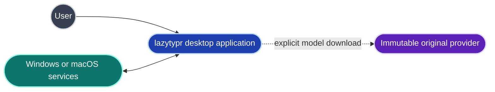
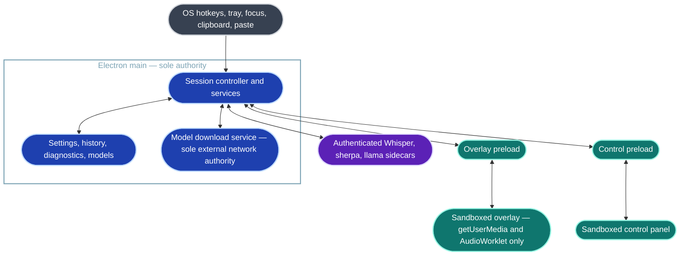
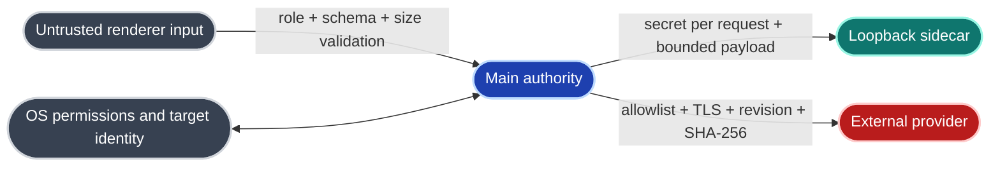
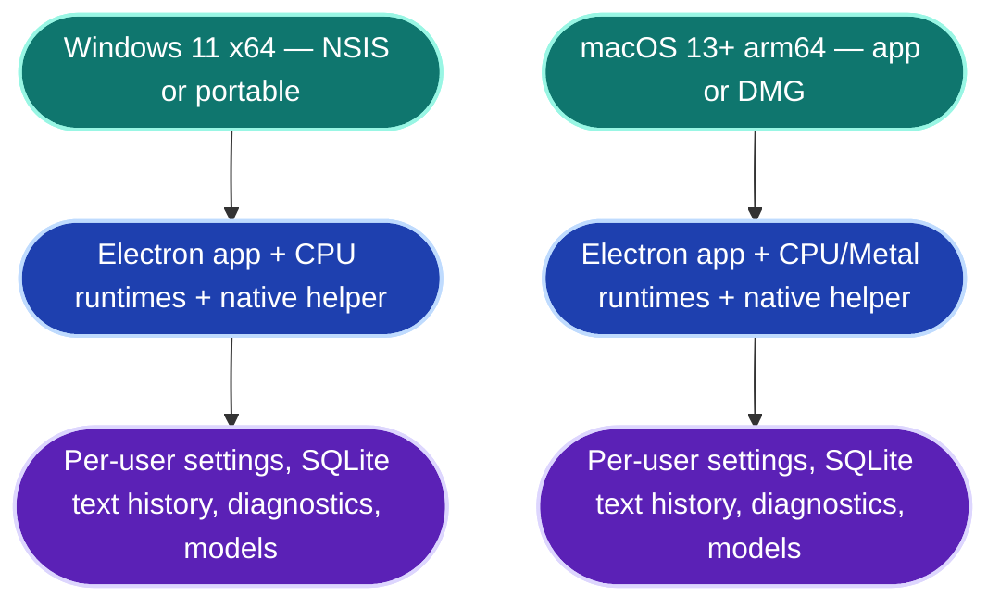
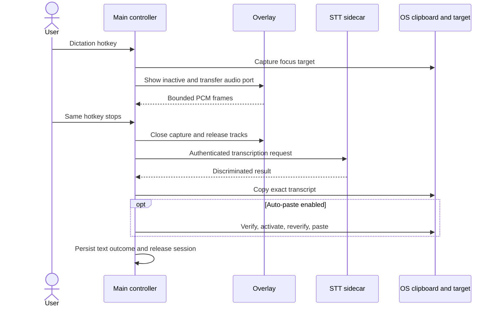
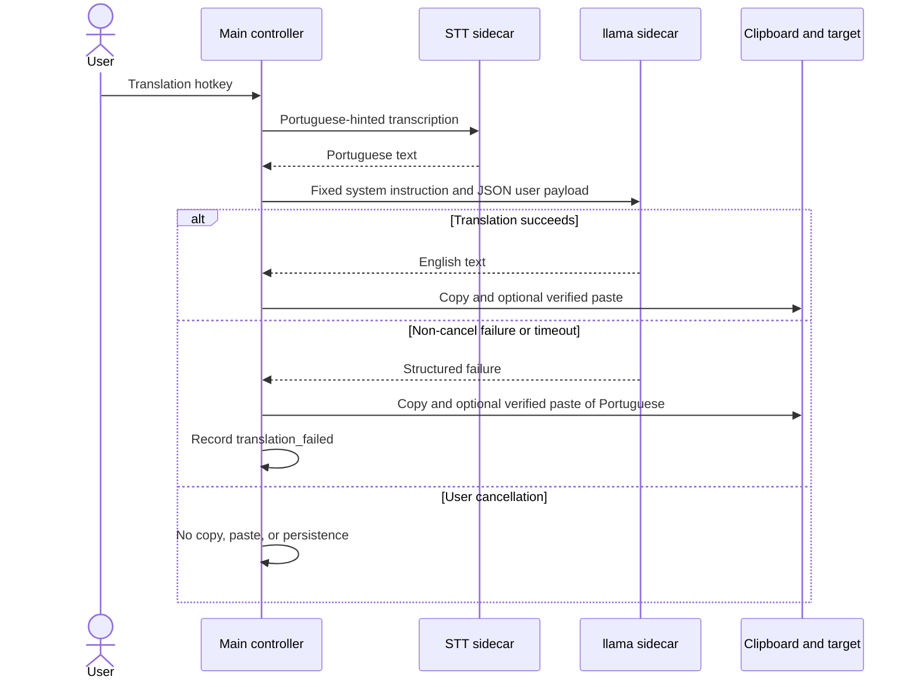

# Architecture

## Context

After setup, only operating-system integration and authenticated loopback
inference remain. Development-tool traffic is not application traffic.

## Process and container view

## Trust boundaries

`nodeIntegration` is false; `contextIsolation`, `sandbox`, and `webSecurity` are
true. Navigation, popups, webviews, renderer downloads, arbitrary external URLs,
and all non-microphone permissions are denied. Production CSP permits packaged
local assets, `data:` images, `blob:` media/workers, and no network connection.

## Deployment

Native modules are built on their target OS. ASAR rules, architecture, hashes,
workers/libraries, executable bits, and Electron ABI fail closed during package
qualification. Models are not bundled. CPU runtimes are planned to be bundled;
optional acceleration assets require explicit reviewed downloads.

## Dictation sequence

## Translation sequence

## Ownership and lifecycle

The session controller owns one UUID session, AbortController, audio port, focus
target, and runtime request. Callbacks carry `sessionId`; stale callbacks are
discarded. The overlay only captures audio and presents state. Repositories and
all OS/network/process operations live in main.

Settings use versioned atomic JSON. History uses main-only SQLite. Diagnostics
are separate, bounded to 200 events or 2 MiB, and redact text/audio/secrets/user
paths. Models install into versioned directories through partial → verified
staging → smoke test → atomic activation; one rollback version is retained.

On success, failure, cancellation, renderer/sidecar crash, application exit, and
startup recovery, main closes ports, stops media resources, zeroes PCM references,
terminates requests, and restores idle. A sidecar that ignores cancellation is
terminated, force-killed after two seconds, restarted, and gates new sessions.

## Architectural decisions

The ten accepted ADRs cover standalone construction, main authority, in-memory
audio, sidecars, catalogs, persistence, native paste, licensing/provenance,
local-only behavior, and GSD delivery. No architectural decision in this file
may override those records.
